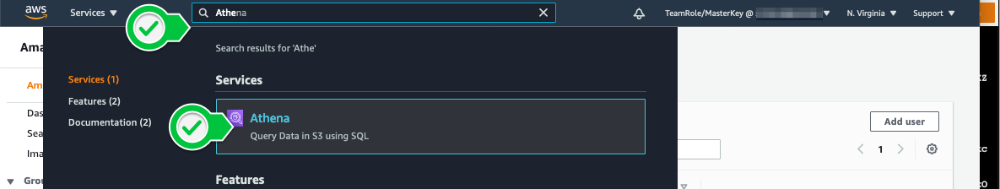
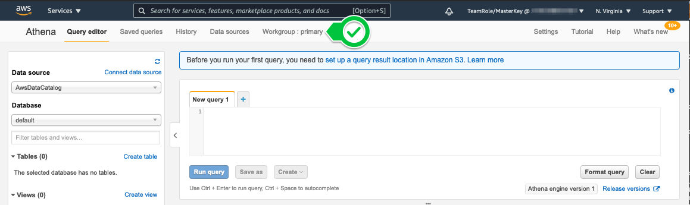
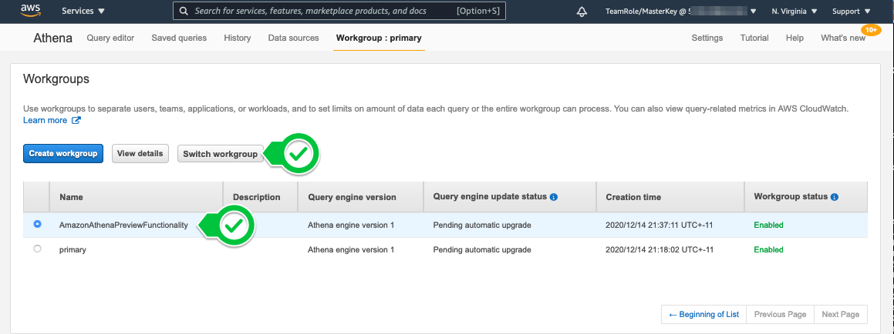
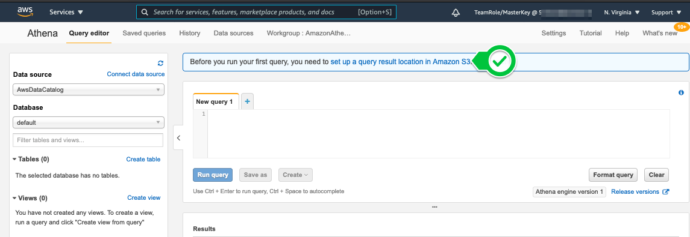
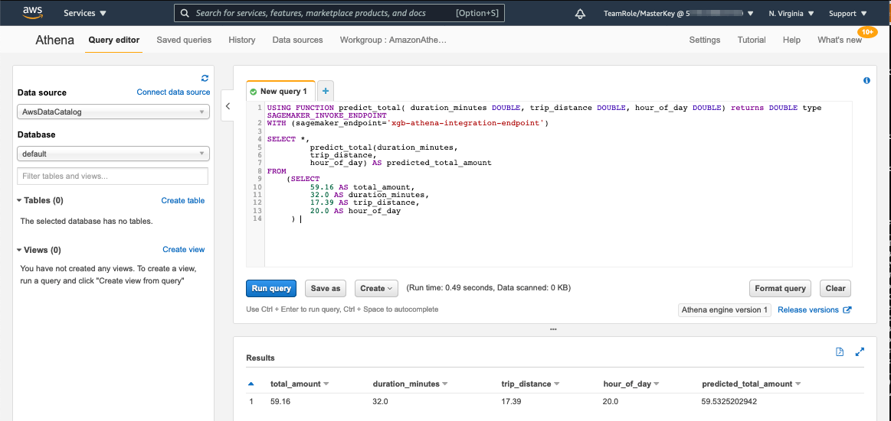
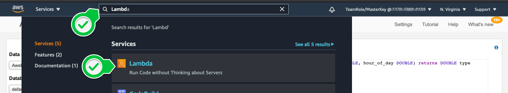
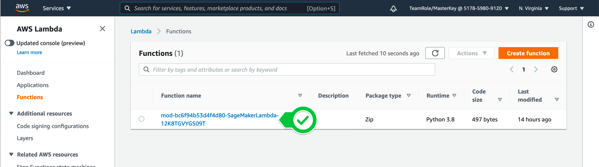
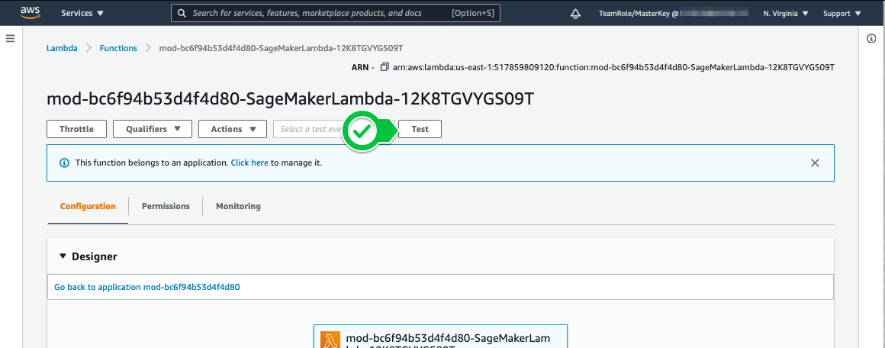
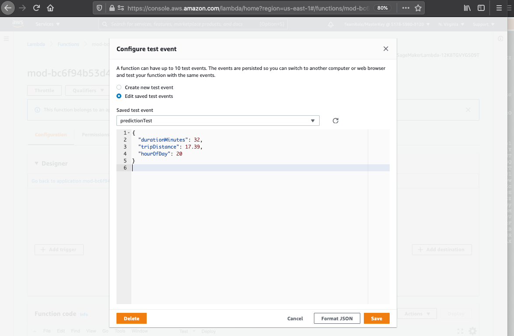
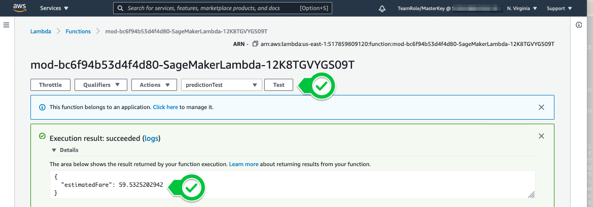

# Amazon SageMaker integration with Amazon Athena and AWS Lambda

## Train using Amazon Athena dataset

Follow the [SageMaker Notebook Instructions](nyc-taxi-athena.ipynb) to source a dataset from Amazon Athena into SageMaker, train and deploy the model.

## Validate inference in Amazon Athena for a single datapoint

* Once the model has been deployed and the last step in the notebook has been executed, please switch to Amazon Athena console.



* Switch Athena workgroup to "AmazonAthenaPreviewFunctionality":




* Once done, define result output location in S3 


* use the output value from the last step in the SageMaker notebook:


* Copy/Paset the query and use CTRL+ENTER to execute:
```sql
USING FUNCTION predict_total( duration_minutes DOUBLE, trip_distance DOUBLE, hour_of_day DOUBLE) returns DOUBLE type SAGEMAKER_INVOKE_ENDPOINT
WITH (sagemaker_endpoint='xgb-athena-integration-endpoint')

SELECT *,
         predict_total(duration_minutes,
         trip_distance,
         hour_of_day) AS predicted_total_amount
FROM 
    (SELECT 
         59.16 AS total_amount,
         32.0 AS duration_minutes,
         17.39 AS trip_distance,
         20.0 AS hour_of_day
     ) 
```


## Validate inference in AWS Lambda
* Open AWS Lambda Console



* Click "Test" to configure Lambda test inputs


* Copy paste the test input - values identical to Athena test
```json
{
  "durationMinutes": 32,
  "tripDistance": 17.39,
  "hourOfDay": 20
}
```


* Save and run the test
